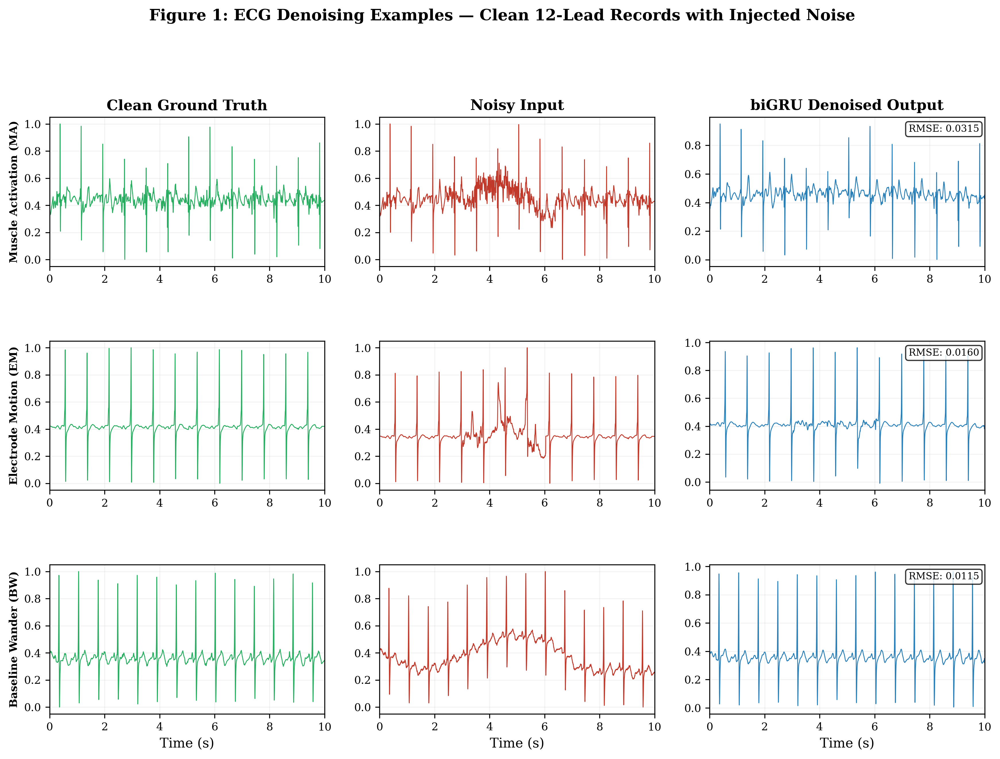
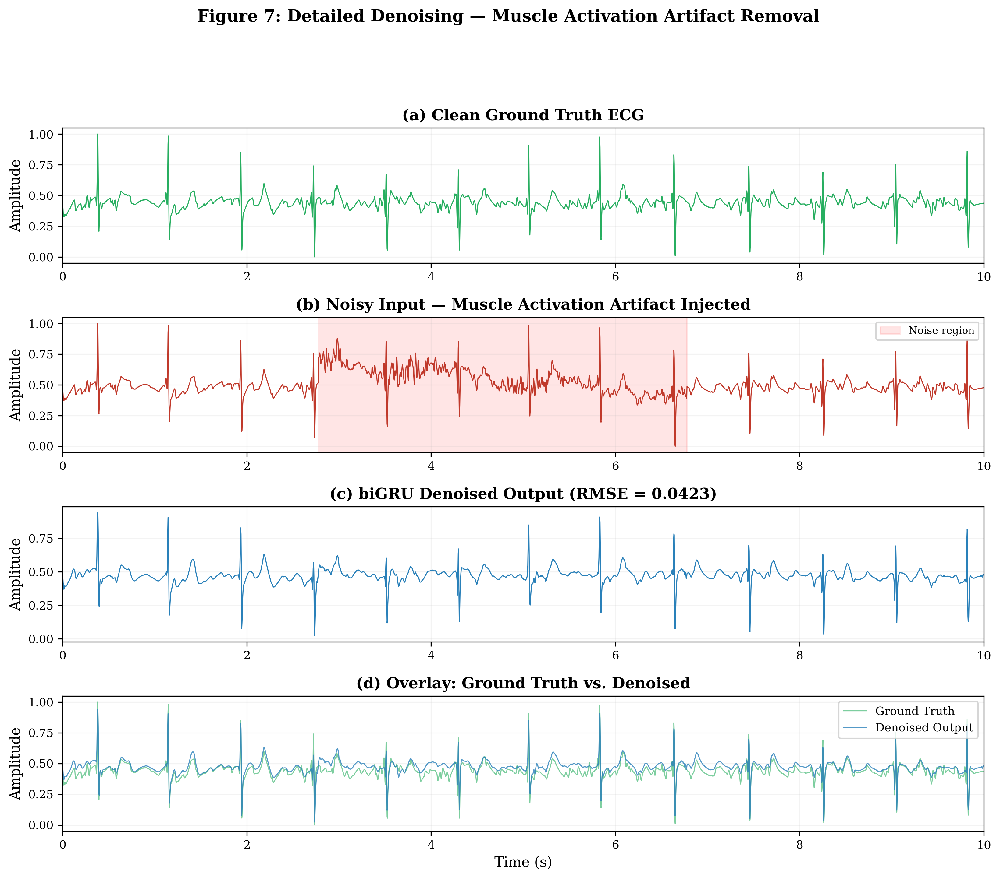
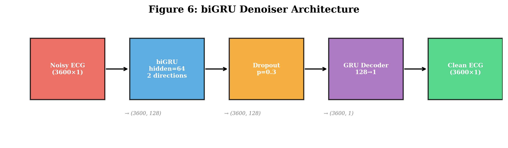
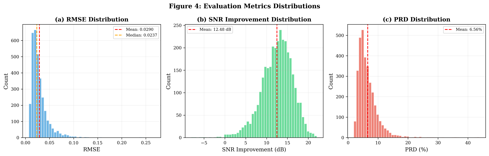

# ECG Signal Noise Removal with Bidirectional GRU

This repository contains a PyTorch implementation of a gated recurrent unit (GRU) model for the task of removing noise from electrocardiogram (ECG) signals.

## Abstract
As the popularity of wearables continues to scale, a substantial portion of the population now has access to (self-)monitoring of cardiovascular activity. In particular, the use of ECG wearables is growing in the realm of occupational health assessment, but one common issue that is encountered is the presence of noise which hinders the reliability of the acquired data.

In this work, we propose an ECG denoiser based on bidirectional Gated Recurrent Units (biGRU). This model was trained on noisy ECG samples that were created by adding noise from the MIT-BIH Noise Stress Test database to clean ECG samples from the PTB-XL database. The model was trained and tested on data corrupted with the three most common sources of noise:
* Muscle Activation (MA)
* Electrode Motion artifacts (EM) 
* Baseline Wander (BW)

After training, the model is able to beautifully reconstruct severely corrupted signals, achieving overall average **Root-Mean-Square Error (RMSE) of 0.029** and improving the **Signal-to-Noise Ratio (SNR) by ~12.5 dB** on average. Its compact size (~104 KB) allows real-time inference on edge devices.

## Performance & Visual Results

The model has been rigorously evaluated on a held-out test set of 3,267 signals across various noise intensities (down to 0 dB SNR).

### 1. Denoising Examples by Artifact Type
The biGRU successfully handles various types of noise while preserving the true QRS morphology.


### 2. High-Fidelity Artifact Removal
Even when a localized burst of muscle activation completely obscures the QRS complexes, the denoiser reconstructs the baseline and peaks accurately.


### 3. Model Architecture
A compact Bidirectional GRU encoder-decoder structure.


### 4. Overall Evaluation Metrics

*(Evaluations computed over the full 3,267 test set samples).*

## Features
* GRU-based model for time series analysis
* Bidirectional GRU for better context capturing
* Comprehensive data preprocessing and synthetic noise injection pipelines
* Pre-trained model weights are provided for immediate inference
* Full mathematical evaluation suite (SNR, RMSE, PRD)

## Installation
```bash
git clone https://github.com/paudel54/Neural_network_signal_processing.git
cd ECG_Denoiser
pip install -r requirements.txt
```

## Databases
For the development of the ECG noise removal model, we created a dataset with noisy and clean versions of ECG signals using two publicly available datasets from PhysioNet:
* **PTB-XL**: https://physionet.org/content/ptb-xl/1.0.3/
* **MIT-BIH Noise Stress Test**: https://physionet.org/content/nstdb/1.0.0/

## Repository Structure
* `tools/`: package including the core functions for evaluation and metrics computation.
* `create_dataset/`: Scripts to create train/val/test splits and inject MIT-BIH noise into PTB-XL records.
  * `1_get_save_data_from_db.py`: Load data from databases
  * `2_train_val_test_split.py`: Split and preprocess the clean ground truth
  * `3_create_noisy_data2_360hz.py`: Synthetically inject noise
* `gru_denoiser.py` and `utils_denoiser.py`: PyTorch model implementation.
* `paper_evaluation.py` and `paper_figures_revised.py`: Master scripts to generate all publication metrics and figures.

## Model Checkpoint
* `best_gru_denoiser_360Hz`: Pre-trained weights for the biGRU model ready for evaluation on 360Hz ECG signals.
